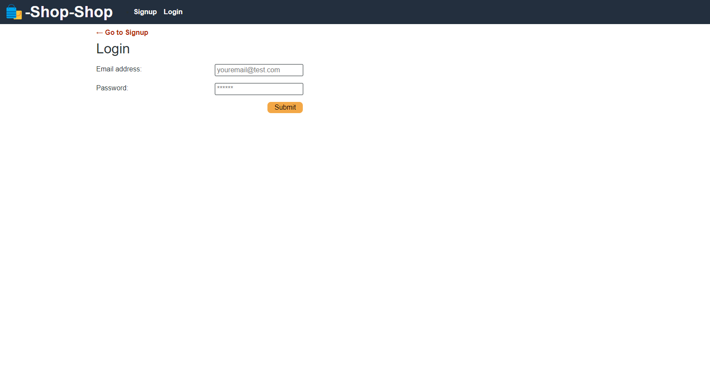
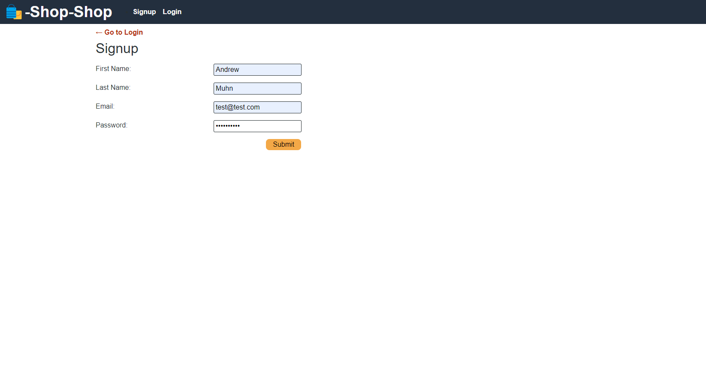
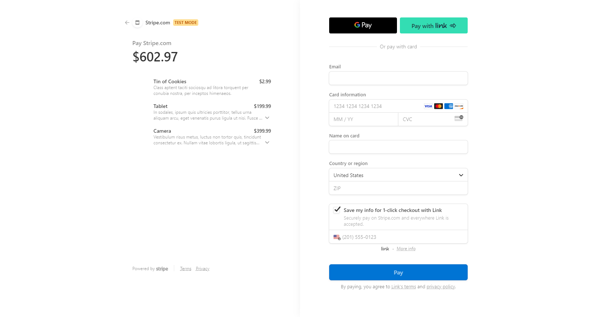
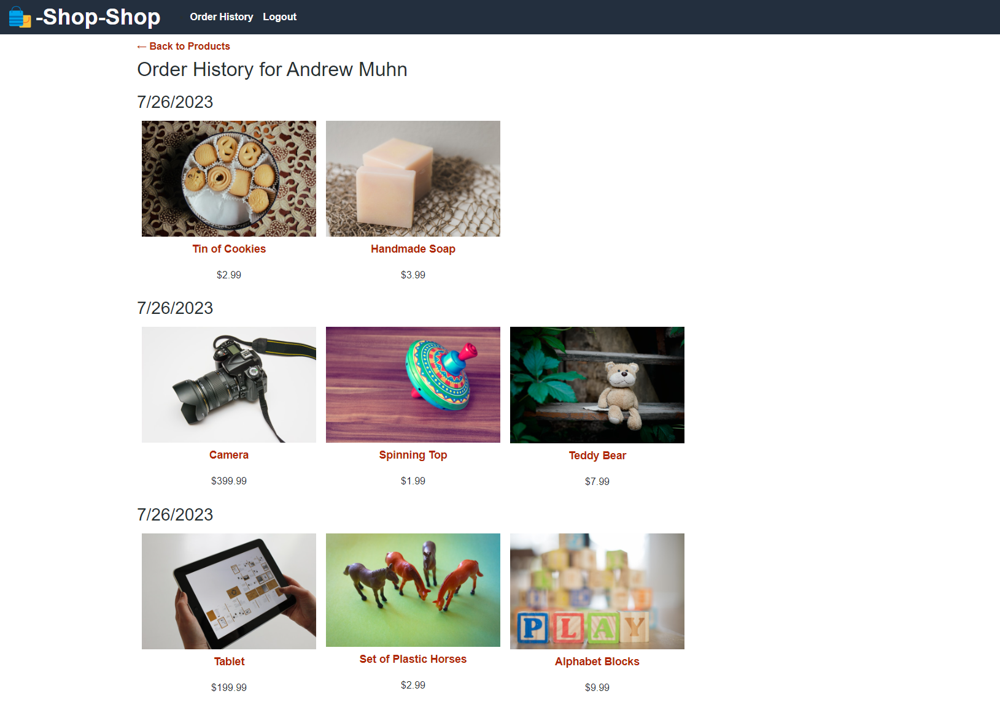

# Redux-Store

## Description

- This basic online store interface allows users to login and buy things using stripe
- The purpose of creating this application was to learn how to convert an app from native React Context API to redux.

## Table of Contents

- [Usage](#usage)
- [Credits](#credits)

## Usage

This application is deployed at:

[Heroku redux-store](https://redux-store-2345-d1209ed545d6.herokuapp.com/)

The repo can be found at:

[github repo](https://github.com/andrewmuhn/redux-store)

To use this app:

Simply naviagte to the above URL. You can then click the login/signup button in the upper left hand corner and enter in your information to either login or get signed up if you are a new use.

Then simply add the items to your cart that you are interested in buying then click checkout when you are ready to checkout.

Then you will be taken to stripe to process the payment.

- **Note**: Do not use your personal credit information. It is a test application and you cannot actual order anything from the website.

Then you can view your orders by clicking the order history tab in the upper left hand corner

## Credits

![edX][edX]

Project created by [Andrew Muhn](https://github.com/andrewmuhn)
as part of UofO Edx Bootcamp

Utilized:

- [![NodeJS][NodeJS]][NodeJS-url]
- [![Express.js][Express.js]][Express-url]
- [![Heroku][Heroku]][Heroku-url]
- [![Nodemon][Nodemon]][Nodemon-url]
- [![React][React.js]][React-url]
- [![Redux][Redux]][Redux-url]
- [![Apollo-GraphQL][Apollo-GraphQL]][Apollo-url]
- [![JWT][JWT]][JWT-url]
- [![Stripe][Stripe]][Stripe-url]
- [![MongoDB][MongoDB]][mongoDB-url]
- [![Bootstrap][Bootstrap.com]][Bootstrap-url]
- [bcrypt](https://www.npmjs.com/package/bcrypt)
- [Mongoose](https://mongoosejs.com/docs/guide.html)
- [concurrently](https://github.com/open-cli-tools/concurrently#readme)

<!-- MARKDOWN LINKS & IMAGES -->

[edX]: https://img.shields.io/badge/edX-%2302262B.svg?style=for-the-badge&logo=edX&logoColor=white
[React.js]: https://img.shields.io/badge/React-20232A?style=for-the-badge&logo=react&logoColor=61DAFB
[React-url]: https://reactjs.org/
[mongoDB]: https://img.shields.io/badge/MongoDB-%234ea94b.svg?style=for-the-badge&logo=mongodb&logoColor=white
[mongoDB-url]: https://www.mongodb.com/
[Apollo-GraphQL]: https://img.shields.io/badge/-ApolloGraphQL-311C87?style=for-the-badge&logo=apollo-graphql
[Apollo-url]: https://www.apollographql.com/docs/
[Express.js]: https://img.shields.io/badge/express.js-%23404d59.svg?style=for-the-badge&logo=express&logoColor=%2361DAFB
[Express-url]: https://expressjs.com/
[Bootstrap.com]: https://img.shields.io/badge/Bootstrap-563D7C?style=for-the-badge&logo=bootstrap&logoColor=white
[Bootstrap-url]: https://getbootstrap.com
[JWT]: https://img.shields.io/badge/JWT-black?style=for-the-badge&logo=JSON%20web%20tokens
[JWT-url]: https://www.npmjs.com/package/jsonwebtoken
[NodeJS]: https://img.shields.io/badge/node.js-6DA55F?style=for-the-badge&logo=node.js&logoColor=white
[NodeJS-url]: https://img.shields.io/badge/node.js-6DA55F?style=for-the-badge&logo=node.js&logoColor=white
[Nodemon]: https://img.shields.io/badge/NODEMON-%23323330.svg?style=for-the-badge&logo=nodemon&logoColor=%BBDEAD
[nodemon-url]: https://nodemon.io/
[Heroku]: https://img.shields.io/badge/heroku-%23430098.svg?style=for-the-badge&logo=heroku&logoColor=white
[Heroku-url]: https://www.heroku.com/
[Redux]: https://img.shields.io/badge/redux-%23593d88.svg?style=for-the-badge&logo=redux&logoColor=white
[Redux-url]: https://react-redux.js.org/introduction/getting-started
[Stripe]: https://img.shields.io/badge/Stripe-626CD9?style=for-the-badge&logo=Stripe&logoColor=white
[Stripe-url]: https://stripe.com/docs
